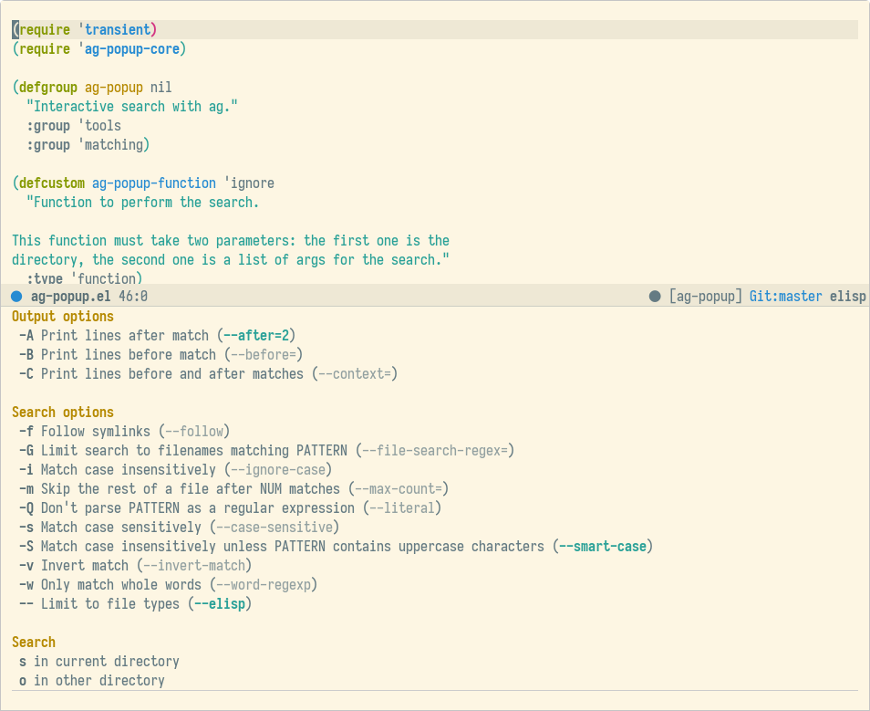

# ag-popup

The power of searching with [ag](https://github.com/ggreer/the_silver_searcher) with transient popups [Magit](https://github.com/magit/magit) style.

# Usage

This package provides a transient popup to configure the arguments of [ag](https://github.com/ggreer/the_silver_searcher) but it **does not** perform the search, instead it relies in the variable **ag-popup-function** to do it.

## Using counsel

If [ivy](https://github.com/abo-abo/swiper) is your completion mechanism of choice, and you use the great [counsel](https://github.com/abo-abo/swiper#counsel) package you can improve `counsel-ag` with:

```elisp
(defun ag-popup-counsel (directory args)
  "Search using `counsel-ag' in DIRECTORY with ARGS."
  (counsel-ag "" directory (mapconcat 'identity args " ")))
  
(setq ag-popup-function #'ag-popup-counsel)
```

## Using ag.el

If you want to use [ag.el](https://github.com/Wilfred/ag.el) to do your searching, you can easily improve it with:

```elisp
(defun ag-popup-ag (directory args)
  "Search using `ag' in DIRECTORY with ARGS."
  (let ((string (read-from-minibuffer "Search string: "))
        (ag-arguments (append ag-arguments args)))
    (ag/search string directory)))
    
(setq ag-popup-function #'ag-popup-ag)
```

# Preview


